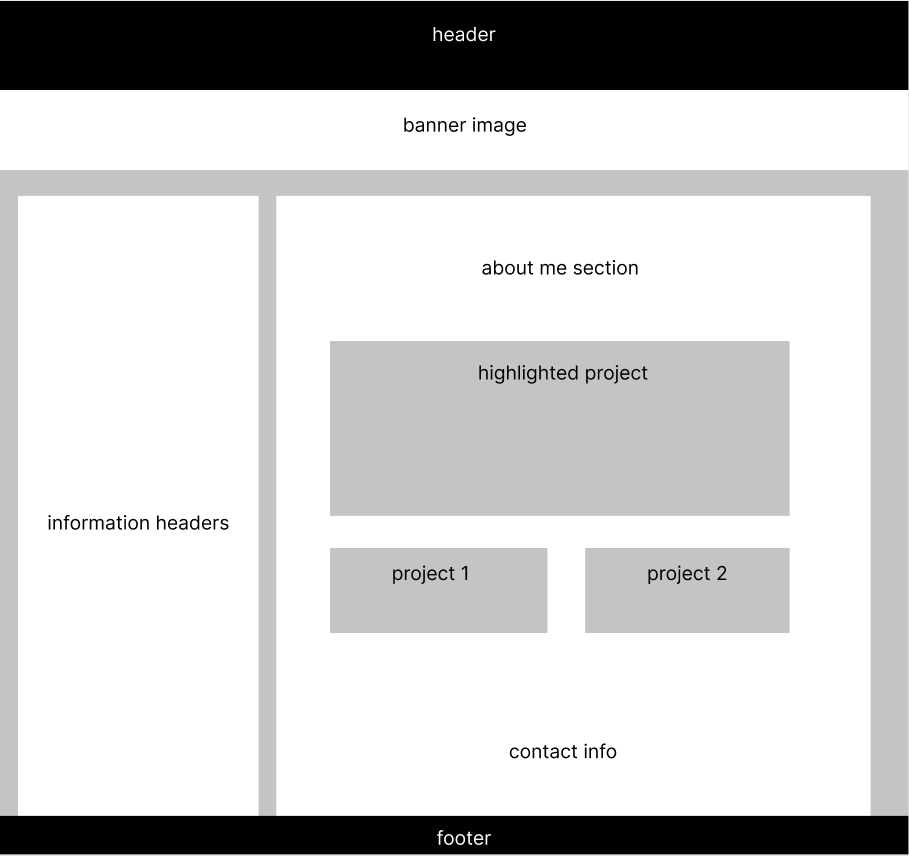
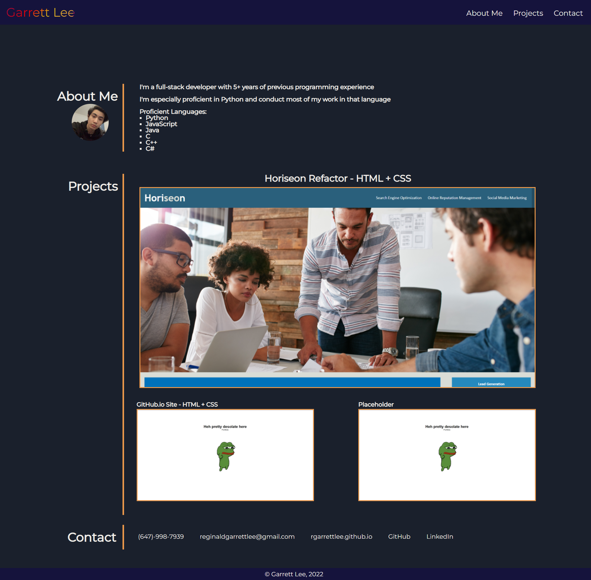

# Portfolio Website

## A platform to showcase and link my work to

I started this project to put my skills with HTML and CSS to the test and create a website where I could showcase my current work and future projects to show potential employers.

The site also allows anyone to reach out and contact me if they have any inquiries

[The project is live here](https://rgarrettlee.github.io/portfolio)

---
## This is the conceptual wireframe I used as a base design

## And here is a preview of the site:

